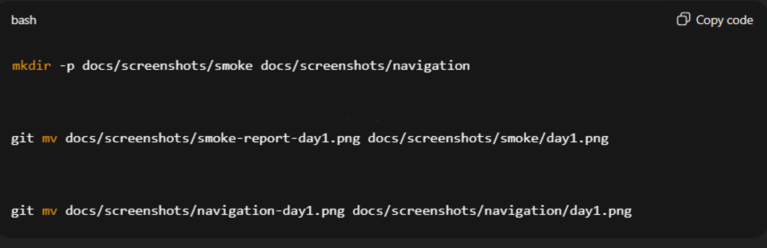
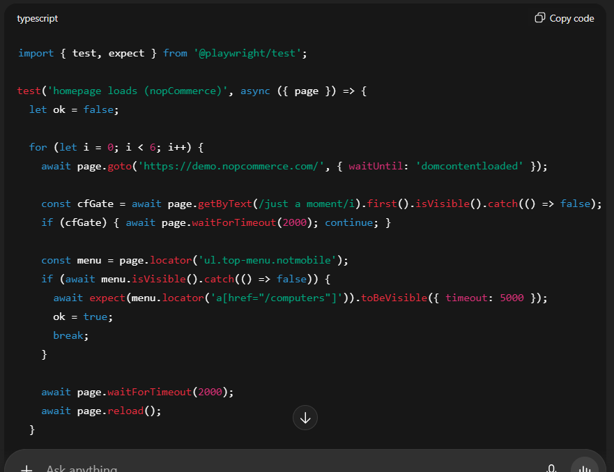
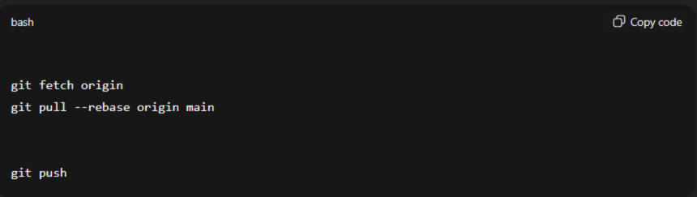

# nopcommerce-qa-capstone
This repository contains a complete QA Capstone project for the nopCommerce demo store. It includes test documentation (Test Plan, Strategy, Coverage Matrix), manual and BDD test cases, automated Playwright tests, CI/CD setup, and HTML reports. AI tools (ChatGPT, Gemini) were used to speed up test design and automation.

## Progress Log

### Day 1
- Created GitHub repository: **nopcommerce-qa-capstone**
- Set up initial folder structure: `/docs`, `/tests`, `/bdd-cucumber`, `/prompts`, `/reports`
- Added `README.md` with project description and progress log
- Installed **Node.js** and **Playwright**
- Wrote smoke test: homepage load verification
- Executed the smoke test and saved the first HTML report
- Wrote navigation test: menu navigation **Computers → Desktops**
- Executed the navigation test and saved the HTML report

### AI Usage (Day 1)

- Used ChatGPT to design initial folder structure and README.md.  
- Used ChatGPT to generate smoke test code (`smoke.spec.ts`).  
- Fixed `.gitignore` with ChatGPT guidance.  
- Saved and linked Playwright HTML reports with ChatGPT help.  
- Debugged Git push issues following ChatGPT instructions.  
- Fixed broken screenshot paths with ChatGPT guidance.  

**Evidence (screenshots):**
- 
- 
- 

## Test Reports

### Smoke Test (Day 1)
- **HTML report:** `docs/reports/20250902-140133/index.html`
- Screenshot: [Day 1](docs/screenshots/smoke/day1.png)

---

### Navigation Test (Day 1)
- **HTML report:** `docs/reports/20250902-navigation/index.html`
- Screenshots:
  - [Summary](docs/screenshots/navigation/day1.png)
  - [Detail](docs/screenshots/navigation/detail-day1.png)
  - [Desktops page](docs/screenshots/navigation/desktops-day1.png)
  - [Terminal run](docs/screenshots/navigation/terminal-day1.png)

