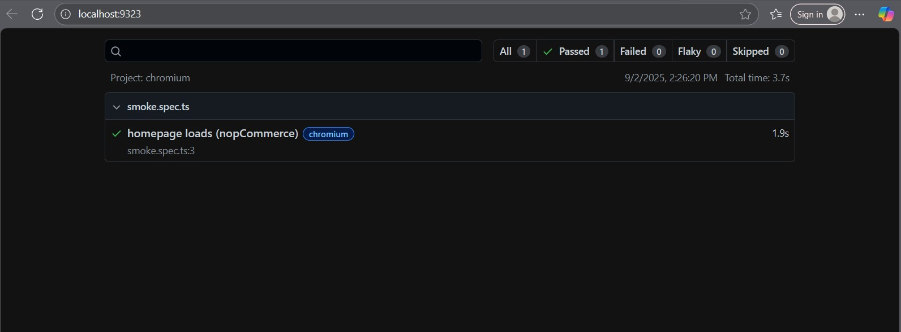
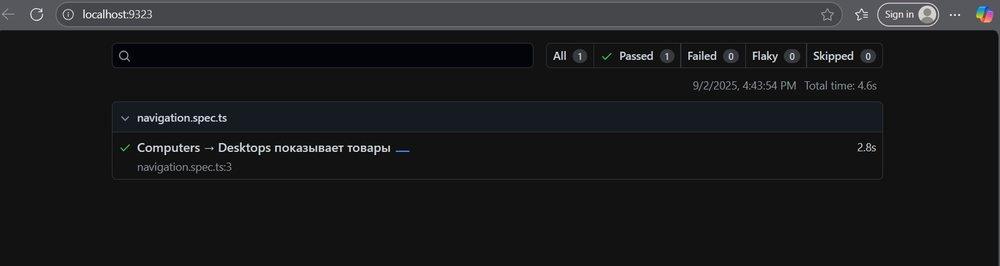
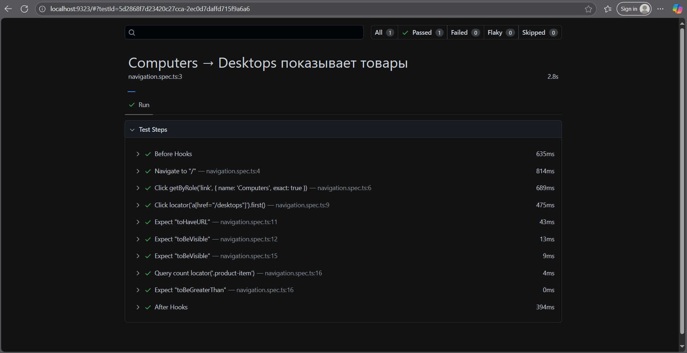

# nopcommerce-qa-capstone
This repository contains a complete QA Capstone project for the nopCommerce demo store. It includes test documentation (Test Plan, Strategy, Coverage Matrix), manual and BDD test cases, automated Playwright tests, CI/CD setup, and HTML reports. AI tools (ChatGPT, Gemini) were used to speed up test design and automation.

## Progress Log

### Day 1
- Created GitHub repository: **nopcommerce-qa-capstone**
- Set up initial folder structure: `/docs`, `/tests`, `/bdd-cucumber`, `/prompts`, `/reports`
- Added `README.md` with project description and progress log
- Installed **Node.js** and **Playwright**
- Wrote smoke test: homepage load verification
- Executed the smoke test and saved the first HTML report
- Wrote navigation test: menu navigation **Computers → Desktops**
- Executed the navigation test and saved the HTML report

## Test Reports

- [Smoke test report (2025-09-02)](docs/reports/20250902-140133/index.html)
- **HTML report:** [docs/reports/20250902-140133/index.html](docs/reports/20250902-140133/index.html)

**Screenshot:**

- [Navigation test report (2025-09-02)](docs/reports/20250902-navigation/index.html)  
  **Screenshot:**  
  
  **HTML report (details)**  

